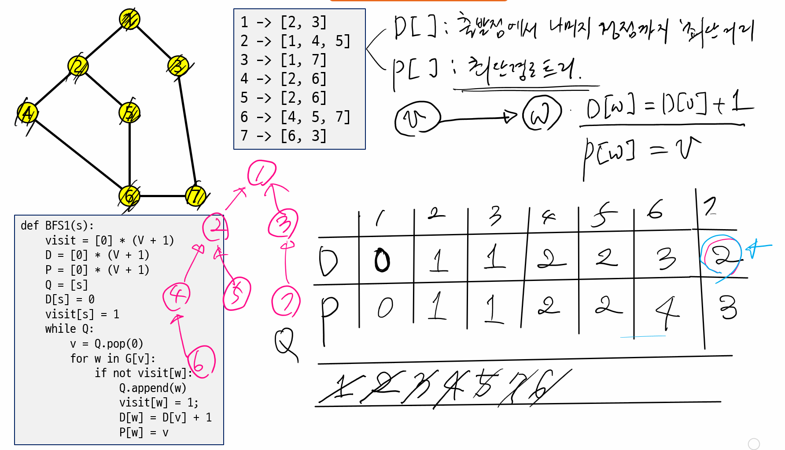

## BFS

- DFS와 마찬가지로 시작점에서 경로가 존재하는 모든 정점들을 방문

  - 경로 유무를 묻는 문제 ==> DFS, BFS로 다 가능
  - 결합 컴포넌트를 찾는 문제
  - 최단경로를 찾는 문제 => BFS로 해결한다.
    - DFS로 풀려면 원래 알고리즘을 수정해야한다.

  

- DFS와의 차이점

  - DFS는 출발점에서 경로가 있는 임의 정점을 처음 방문할 때 최단으로 방문한다는 보장을 못한다.
  - BFS는 처음 방문할 때 항상 최단으로 방문한다.
    - 그렇지만, 가중치가 부여된 그래프에서는 역시 안된다. (근데, 수정하면 된다.)




- 거리와 경로 계산

```python
def BFS(s):
    visit = [0] * (V + 1)
    D = [0] * (V + 1)  # 시작점에서 최단 거리
    P = [0] * (V + 1)  # 최단 경로 트리(부모 저장)
    Q = [s]
    D[s] = 0
    visit[s] = 1        # 시작점을 방문하고, 큐에 삽입
    while Q:            # 빈 큐가 아닐동안 반복
        v = Q.pop(0)
        for w in G[v]:  # v의 방문하지 않은 인접 정점 w을 찾는다.
            if not visit[w]:
                Q.append(w)
                visit[w] = 1;
                D[w] = D[v] + 1
                P[w] = v
```


- 방문 정보와 거리를 저장하는 배열을 같이 사용

```python
def BFS(s):
    visit = [0] * (V + 1)
    Q = [s]
    visit[s] = 1        # 시작점을 방문하고, 큐에 삽입
    while Q:            # 빈 큐가 아닐동안 반복
        v = Q.pop(0)    # v의 방문하지 않은 인접 정점 w을 찾는다.
        for w in G[v]:
            if not visit[w]:
                Q.append(w)
                visit[w] = visit[v] + 1
```


