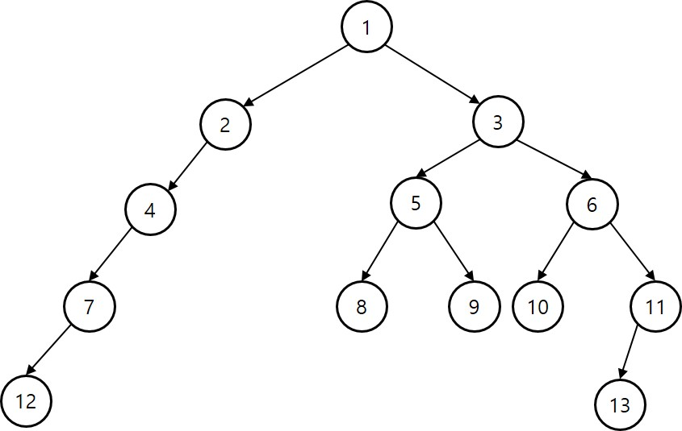

## Tree

- 트리는 무향 그래프다.
  - 루트가 정해져 있을 수 있다.
- 트리는 연결 컴포넌트(Conntected component)다.
  - 트리에 속한 임의의 두 정점 u, v 사이에 경로가 반드시 하나만 존재.
- 트리는 싸이클이 없다.
  - 트리를 순회할 때 방문표시/체크를 안하네..
  - 트리에 속한 정점수가 |V|개 라면 간선수는 |V-1|개

-----------------------------

- 트리를 저장
  - 계층적 구조(포함 관계)를 표현
  - 부모-자식 관계를 저장
  - 각 정점마다 자식 정보를 저장, 필요하면 부모 정보도 저장

------------

#### 트리 순회

- 깊이 우선 탐색 방법으로 순회
  - 반드시 오른쪽자식 보다 왼쪽자식을 먼저 방문한다.
- 모든 정점을 3번 거쳐간다. ==> 방문할 수 있는 시점이 3군데 있다.
  - 정점에 처음 진입하면서 방문 --> 전위
  - 왼쪽 자식에서 돌아와서 방문 --> 중위
  - 오른쪽 자식에서 돌아와서 방문 --> 후위


--------------------

```
13 12        # 정점수 간선수
1 2 1 3 2 4 3 5 3 6 4 7 5 8 5 9 6 10 6 11 7 12 11 13

```



> 트리 순회 연습
  - 전/중/후위 순회
  - 트리의 높이를 계산.  
    - 1이 루트인 트리의 높이 --> 4
    - 3이 루트인 트리의 높이 --> 3
  - 높이가 3인 노드들 찾기. 
    - (7, 8, 9, 10, 11)
  - 3번 노드가 루트인 트리의 전체 노드수를 계산.
    - 8 개
  - 8번 노드와 10번 노드의 공통조상을 찾기.
    - (1, 3)

---------


