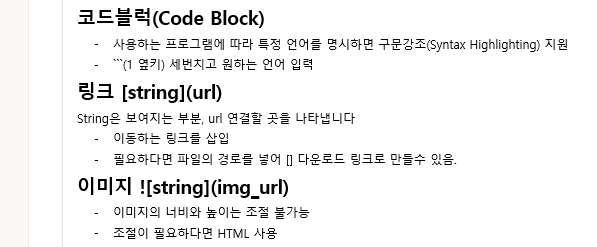

``` python
print("hello")
```

```html
<h1>
    제목입니다.
</h1>
```

글 내용의 일부분에 코드를 ```inline code block```

[네이버로가기](https://www.naver.com/)



**굵게**

*기울인 텍스트* 단축키 ctrl +l

~~취소선~~

---------------

